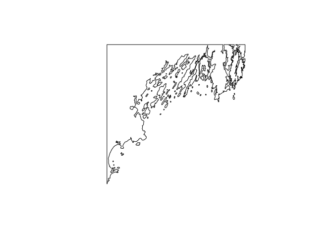
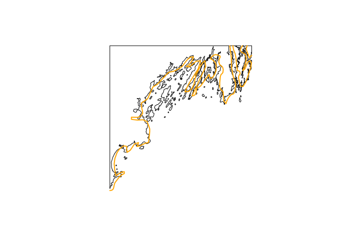

GSHHG
================

Managing [GSHHG datasets](https://www.soest.hawaii.edu/pwessel/gshhg/)
with R. This package provides simple utilities for downloading and
accessing GSSHG spatial data from R.

## Requirements

- R (v4.1+)
- [rlang](https://CRAN.R-project.org/package=rlang)
- [dplyr](https://CRAN.R-project.org/package=dplyr)
- [sf](https://CRAN.R-project.org/package=sf)

## Installation

    remotes::install_github("BigelowLab/gshhg")

## Set your data path

You’ll be storing data in what we call your root data path. You can set
this once and the package will always know where to find your data. If
you move your data at a later time, you can simply reset your path.
Obviously, you’ll edit the path shown below to suit your needs.

``` r
suppressPackageStartupMessages({
  library(sf)
  library(rnaturalearth) # for later comparison
  library(gshhg)
})

set_root_path("/mnt/s1/projects/ecocast/coredata/gshhg")
```

## Fetch data

We don’t run this for the README, but you can see below that the package
is configured to fetch the most recent distribution (version 2.3.7) and
store it in your root data directory. It’s that easy!

    fetch_gshhg()

## Reading data

Data are grouped into “shoreline”, “border” and “river” groups. Each of
those is divided into groups of varying resolutions, and further split
into levels. Depth of levels for each group vary. Consult the
“SHAPEFILES.TXT” text file to get the details. We default to full
resolution and level 1 for each group. Here we read full resolution
global shoreline, but by cropping it we retrieve the geometry only
(attributes are dropped). Cropping may take a bit of time because we
mist first validate the input geometry.

``` r
box = c(xmin =  -70.391812, ymin = 43.367748,
        xmax =  -69.703238, ymax = 43.901879) |>
  sf::st_bbox(crs = 4326) |>
  sf::st_as_sfc()
x = read_gshhg(bb = box)
plot(x)
```

<!-- -->

## Compare to [NaturalEarth](https://www.naturalearthdata.com/)

[NaturalEarth](https://www.naturalearthdata.com/) is a nice dataset that
we often use for mapping shorelines. It comes in “low”, “medium” and
“high” resolutions. We’ll read in the high resolution NaturalEarth data
for the same bounding box above.

``` r
ne = rnaturalearth::ne_coastline(scale = "large", returnclass = "sf") |>
  sf::st_geometry() |>
  sf::st_crop(box)

plot(x, reset = FALSE)
plot(ne, add = TRUE, col = "orange", lwd = 2)
```

<!-- -->

Clearly the GSHHG data contains much higher resolution data, but who is
to say one is better than the other registration-wise? Each has it’s
use, and it is nice to have both at hand.
